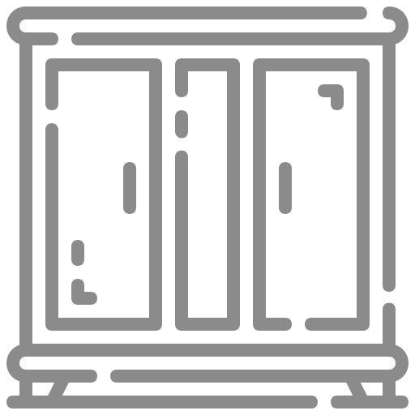

# Armaria

> Armaria are a kind of closed, labeled cupboards that were used for book storage in ancient times up till the middle ages.



Armaria is a new way to manage your bookmarks.

As it stands bookmarks are stored either in the cloud, in browser specific formats, or both. It doesn't have to be this way. Armaria stores bookmarks in a SQLite database. This means your bookmarks are local and stored in a single file. They can then be accessed with a myriad of clients including browsers.

You can sync this file across your devices however you would sync any other file. This allows you to share your bookmarks across many different devices and browsers without having to rely on a web service for something as simple as your bookmarks.

> [!CAUTION]
> This software is still in progress and should be considered pre-alpha

# Supported Platforms

|           | Linux x64 | Windows x64 | MacOS x64/arm64 |
|-----------|-----------|-------------|-----------------|
| Snapcraft | Yes       | No          | No              |
| Winget    | No        | Yes         | No              |
| Homebrew  | No        | No          | Yes             |

# Features

The features for Armaria are similar to other bookmark implementations:

- URL, Name, and Description fields
- Nested folder structure
- Tags
- Full text search
- Manual ordering

# Clients

This repository contains the core Armaria library as well as the following clients:

- **CLI:** A CLI that can be used to manage your bookmarks database from the command line.
- **TUI:** A TUI that can be used to manage your bookmarks (hosted in the CLI at `armaria tui`).
- **Native Messaging Host:** A native messaging host to enable browsers to interact with your bookmarks database.

# Getting Started

You can find the installation instructions for your platform here.

## Linux

You can install Armaria with Snap on Linux:

``` shell
snap install armaria
```

## MacOS

You can install Armaria with Homebrew on MacOS:

``` shell
brew install JonathanHope/homebrew-armaria/armaria
```

# Windows

You can install Armaria with WinGet:

``` shell
winget install Armaria
```

# Browser Extensions

Armaria has a browser extension. You can read about it [here](https://github.com/jonathanhope/armaria-extension).

# Roadmap

This software is still in it's early days. This roadmap lays out where it currently is, and where it is going. If there is something that you think should be on it that is not please open an issue.

**Platform Support:**

- [x] Windows x64
- [x] Linux x64
- [x] MacOS x64
- [x] MacOS arm64

**Distribution:**

- [x] Snap
- [x] Homebrew
- [x] Winget
- [ ] Nix

**Library:**

- [x] Add bookmark
- [x] Add folder
- [x] Delete bookmark
- [x] Delete folder
- [x] Update bookmark
- [x] Update folder
- [x] Add tag
- [x] Remove tag
- [x] List bookmarks/folders
- [x] Install manifest
- [x] Config file
- [ ] Import bookmarks from exported files

**Native Messaging Host:**

- [x] Add bookmark
- [x] Add folder
- [x] Delete bookmark
- [x] Delete folder
- [x] Update bookmark
- [x] Update folder
- [x] Add tag
- [x] Remove tag
- [x] List bookmarks/folders

**TUI:**

- [ ] Add bookmark
- [x] Add folder
- [x] Delete bookmark
- [x] Delete folder
- [ ] Update bookmark
- [ ] Update folder
- [ ] Add tag
- [ ] Remove tag
- [x] List bookmarks/folders
